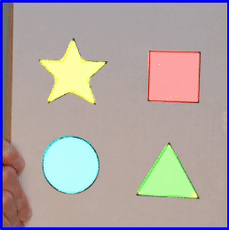
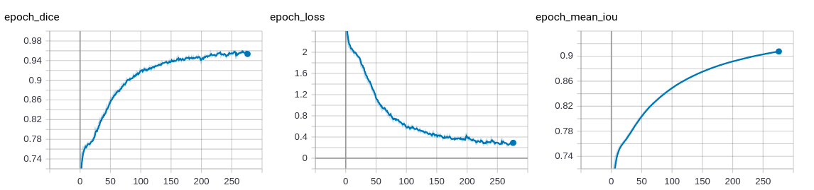
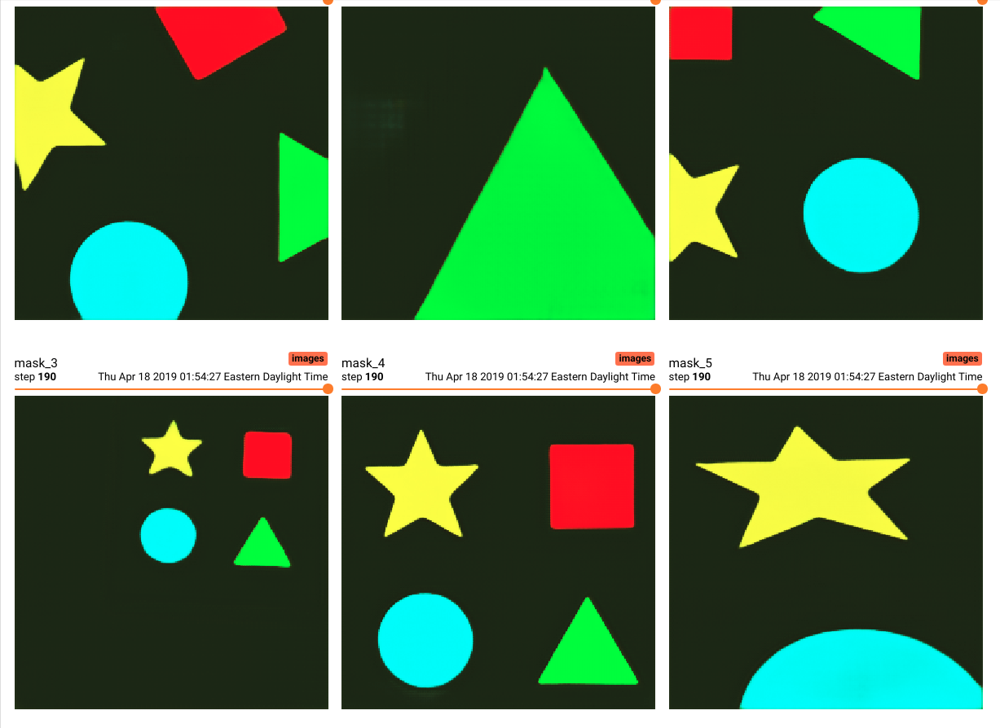
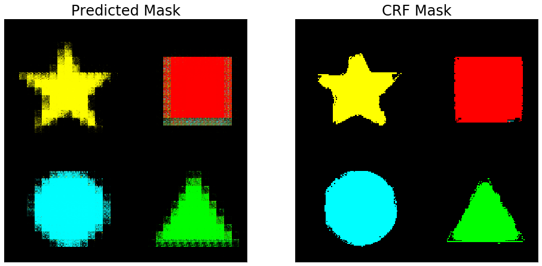

# Semantic Shapes: Custom Semantic Segmentation Tutorial/ Pipeline

This repository provides a pipeline to develop different semantic segmentation models.

U-Net and FCN-8 are supported.

## Install

Make sure you have a working versions of CUDA, cudnn, and nvidia drivers.

## Collection

**Change imshape in config.py and try importing the models before collecting images**

I used a shape of (256, 256, 3), but make sure before you collect your images\
to make sure they fit with the model you want to use.

Images for FCN-8 should have a shape with a multiple of 32. (in order to be upsampled 32 times)

`python collect.py`

Starts a thread for a webcam (utils.py) as device 0. Press S to save images to the images directory.

## Annotation

Images should be annotated in labelme and output to a separate directory (annotated).
The only thing that matters is the polygon class label.

## Training

config.py will have all the settings you want to change.

1. imshape: (width, height, n_channels)
2. mode: 'binary' or 'multi'
3. model_name: string to name your model's save file
4. logbase: directory for tensorboard. usually: 'logs'
5. hues: dictionary to set hues for each label from json files

`python train.py`

## Tensorboard

Once the model is training, view tensorboard using:

`tensorboard --logdir=logs`

## Stream

Stream will use whatever model_name is set in config.py

`python stream.py`

B - Toggle Background

C - Toggle CRF

M - Softmax vs Argmax Mode

## Conditional Random Fields

Conditional random fields may produce an improved mask.

